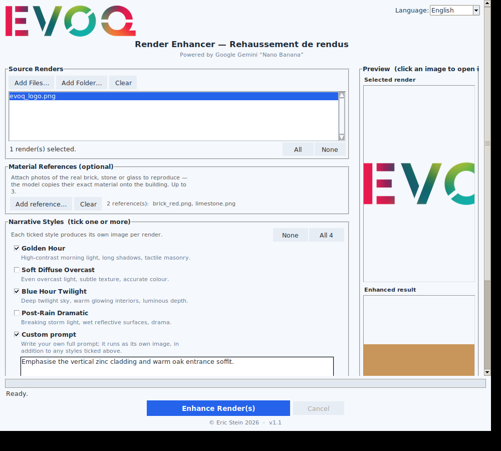
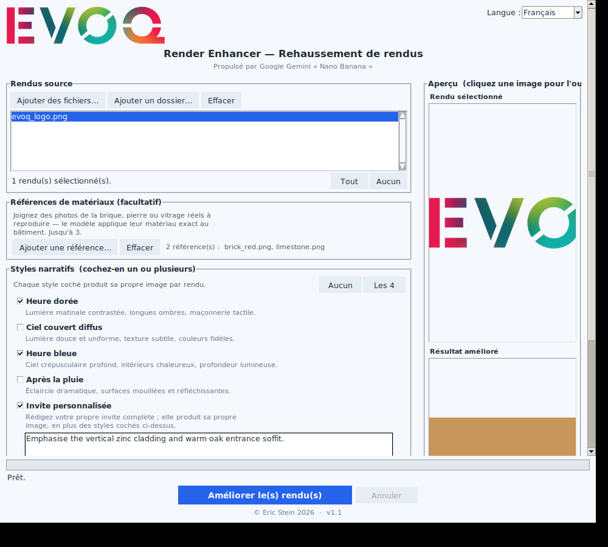

# EVOQ Render Enhancer

A small Windows desktop app that turns architectural renders (e.g. Enscape
output) into **hyper-photorealistic presentation images** to help get a design
approved by a client. It uses Google's Gemini **"Nano Banana"** image model
(`gemini-2.5-flash-image`) for image-to-image enhancement, keeping the original
viewpoint, geometry and proportions while re-lighting and re-texturing the scene.

The GUI is **bilingual (English / Français)** — switch languages any time with
the **Language / Langue** selector in the top-right; your choice is remembered.




## The four narrative styles

Tick **one or more** styles per run — each ticked style produces its own image
for every selected render (use **All 4** to generate the full comparison set in
one click, ideal for presenting options to a client). Each prompt enforces
strict adherence to the base render's geometry and keeps human figures small and
in the mid/background only.

1. **Golden Hour** — high-contrast low-angle morning sun, long shadows, tactile
   masonry, warm specular metal.
2. **Soft Diffuse Overcast** — even overcast light, perfect material definition,
   subtle texture, accurate colour, matte metal.
3. **Blue Hour Twilight** — deep twilight sky with warm interiors glowing from
   every window, luminous contrast and depth.
4. **Post-Rain Dramatic** — breaking storm light on wet, reflective surfaces,
   damp masonry, sharp ground reflections.

You can add free-text **Extra instructions** that are appended to the chosen
narrative for any run.

## Getting a Gemini API key

1. Go to Google AI Studio → **Get API key**.
2. Paste it into the app's *Gemini API Key* field. Tick *Remember key* to store
   it locally (in `~/.evoq_render_enhancer.json`); untick to keep it in memory
   only for the session.

## Using the app

1. Add one or more renders (drag-and-drop, **Add Files…**, or **Add Folder…**).
   Supported: JPG, PNG, WEBP, BMP.
2. Select the renders you want to enhance in the list.
3. *(Optional but recommended for material fidelity)* attach up to **3 material
   reference photos** — close-ups of the real brick, stone or glass — via
   **Material References → Add reference…**. See below.
4. Tick one or more narrative styles (or **All 4**). You can also tick
   **Custom prompt** and write your own full prompt — it runs as its own image,
   in addition to any built-in styles you ticked.
5. Choose an output folder.
6. Click **Enhance Render(s)**. Use **Cancel** to stop a batch mid-run.

Each result is saved as `<originalname>_<style>.png` in the output folder, and
the latest result is previewed in the window. Click either preview image to open
it full-size in your default viewer. Large renders are automatically downscaled
to 2048 px on the long edge before upload.

Transient API errors (rate limits, server hiccups, network blips) are retried
automatically with exponential backoff, so a single glitch won't fail a whole
batch.

### Material references (for accurate brick, stone & glass)

The single biggest lever for material realism is showing the model the *actual*
specified materials. Attach 1–3 close-up photos of the real brick, stone or
glazing and the model reproduces their exact colour, texture, mortar joints,
weathering, finish and reflectivity on the matching surfaces of the building —
instead of inventing generic materials — while keeping the geometry unchanged.

- Use tightly-cropped material swatches (a wall of the brick, a stone sample, a
  glazing close-up), not full scenes; the model treats them as material samples,
  not compositions to copy.
- References apply to every render and every style in the run.
- They are sent alongside each render on every request (downscaled to 1280 px).

## Building the Windows .exe

Requires Python 3.11+ on Windows.

```bat
pip install -r requirements.txt
build_render_enhancer.bat
```

The single-file executable is produced at `dist\RenderEnhancer.exe`.
Equivalent explicit command (uses the committed spec):

```bat
pyinstaller render_enhancer.spec
```

### No Windows machine? Let GitHub build it

Two GitHub Actions workflows build the exe for you — no local Windows/Python
setup needed:

- **Test builds** (`build-render-enhancer.yml`) run automatically on every push
  to the feature branch (and via **Run workflow** on the Actions tab). Download
  the exe from the run's **Artifacts** section. Artifacts expire after 90 days
  and download as a `.zip`.
- **Releases** (`release-render-enhancer.yml`) run when you push a version tag,
  and publish a permanent GitHub Release with `RenderEnhancer.exe` attached:

  ```sh
  git tag v1.0
  git push origin v1.0
  ```

  The exe is then downloadable from a stable, no-login URL (no unzip needed):

  ```
  https://github.com/<owner>/<repo>/releases/latest/download/RenderEnhancer.exe
  ```

  Share that link directly with colleagues or clients. You can also trigger a
  release manually from the Actions tab via **Run workflow**.

## Running from source (any platform with a display)

```sh
pip install Pillow requests certifi tkinterdnd2
python render_enhancer.py
```

`tkinterdnd2` is optional — without it the app still works, just without
drag-and-drop.

## Limitations & getting the best results

This tool uses a general-purpose generative image model (Gemini "Nano Banana"),
which **outputs at roughly 1 megapixel (~1024 px on the long edge)** regardless
of input size. That single fact sets realistic expectations:

**What it does well**
- Relighting a render into a convincing narrative (golden hour, overcast, blue
  hour, post-rain) — sun angle, shadows, sky, ambience.
- Mood, atmosphere, wet-ground reflections, glass reflections/transparency.
- Adding believable, well-placed background entourage for scale.
- A general lift from "CGI render" toward "photograph."

**What it cannot reliably do**
- Crisp, construction-accurate **fine repetitive micro-texture across a whole
  building** — most notably **brick coursing and mortar joints on a full
  façade**. At ~1024 px output, a full elevation gives each brick only 2–3
  pixels, which is far too few to draw a correct running bond. No prompt wording
  can overcome this pixel budget; it is a limitation of single-shot generation
  at this resolution, not of the prompt.

**Tips to get the most out of it**
- **Frame tighter.** A closer or cropped view (one bay, an entrance, a corner)
  puts far more pixels on each brick, so material and coursing read much better
  than on a wide whole-building shot. Enhance detail views separately from the
  hero wide shot.
- **Attach a material reference** (Material References panel) for accurate
  colour, finish and reflectivity of the specified brick/stone/glass.
- Treat outputs as **presentation / mood imagery for client approval**, not as
  construction-accurate material studies.
- Generate a few variations and pick the best; results vary run to run.

> Achieving crisp façade-scale brick would require a tiling pipeline (enhance
> overlapping crops at full resolution, then stitch) or a dedicated upscaler.
> That is out of scope for this version; ask if you want it explored later.

## App icon

The executable ships with a custom icon (a modernist building in two-point
perspective at sunset), stored at `assets/render_enhancer.ico`. To regenerate it
(e.g. after tweaking the design), run:

```sh
python tools/make_icon.py
```

This rewrites `assets/render_enhancer.ico` and `assets/render_enhancer_icon.png`
(the latter is used for the window / taskbar icon at runtime).

## Notes

- The GUI is fully localised in English and Canadian French. The narrative
  prompts sent to Gemini stay in English by design — the model is tuned for the
  engineered English wording — while every on-screen label, message and style
  name is translated.
- The prompts deliberately avoid diffusion jargon such as "low denoising" (which
  Nano Banana reads as "change as little as possible" and which flattens
  materials). Instead they lock geometry, camera and openings while explicitly
  licensing a full re-render of surfaces and lighting, and they describe real
  masonry — running bond, level coursing aligned to openings, recessed weathered
  mortar, per-unit variation, no tiling — so brick and stone read naturally
  rather than as flat CGI texture. Source renders are uploaded at up to 3072 px
  to give the model finer detail to work from.
- The Gemini image model outputs roughly ~1K–2K resolution; the "8k" wording in
  the prompts is a stylistic cue to the model, not a literal output size.
- If a request is safety-blocked or returns text instead of an image, the app
  reports the reason per file and continues with the rest of the batch.
- The window opens sized to your screen and the content area scrolls (mouse
  wheel or scrollbar); the progress bar, status line and **Enhance / Cancel**
  buttons stay pinned at the bottom so they are always reachable, even on small
  laptop screens.
